# iTrack Zimbabwe

**iTrack Zimbabwe** is a PHP 8.1+ ERP-style operations application for inventory, procurement, sales, accounting, GPS device management, requisitions, reporting, notifications, and user administration.

## Implemented modules

The application now includes authenticated dashboard access with role-aware navigation, inventory CRUD, supplier and client CRUD, GPS device CRUD, notification CRUD, user administration, purchase-order capture and status updates, sales capture and status visibility, requisition submission and approval, report-record generation, accounting summary data, and reusable security, session, validation, formatting, upload, and permission helpers.

The public JSON surface is available at `/api/auth.php`, `/api/inventory.php`, `/api/purchases.php`, `/api/sales.php`, `/api/requisitions.php`, `/api/reports.php`, `/api/accounting.php`, and `/api/gps.php` when using the built-in server. The original API files remain available at the repository-level `api/` directory for Apache deployments.

## Requirements

- PHP 8.1 or newer
- PDO SQLite for the local fallback, or PDO MySQL for production
- A writable `storage/` directory and writable upload directories

## Run locally

From the repository root, run:

```bash
php -S 127.0.0.1:8000 -t public
```

On Windows with XAMPP, use the PHP executable bundled with XAMPP if `php` is not on your `PATH`:

```powershell
Set-Location C:\xampp\htdocs\itrack-zimbabwe
& C:\xampp\php\php.exe -S 127.0.0.1:8000 -t public
```

Keep the terminal running while using the application. Press `Ctrl+C` in that terminal to stop the server.

Open [http://127.0.0.1:8000/login.php](http://127.0.0.1:8000/login.php).

The application creates or uses `storage/itrack.sqlite` when PDO MySQL is unavailable. Configure `APP_BASE_URL`, database settings, and session settings in `.env` for a subdirectory or production deployment.

## Default local login

- Email: `admin@example.com`
- Password: `password`

Change the default password immediately in any non-local environment.

## Screenshots

The repository includes current application screenshots in [`docs/screenshots/`](docs/screenshots/). The gallery covers the public login screen and the authenticated dashboard and module pages.

| Screen | Preview |
|---|---|
| Login | 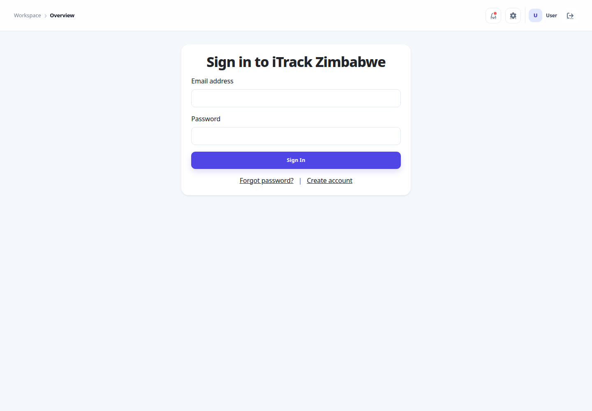 |
| Dashboard | 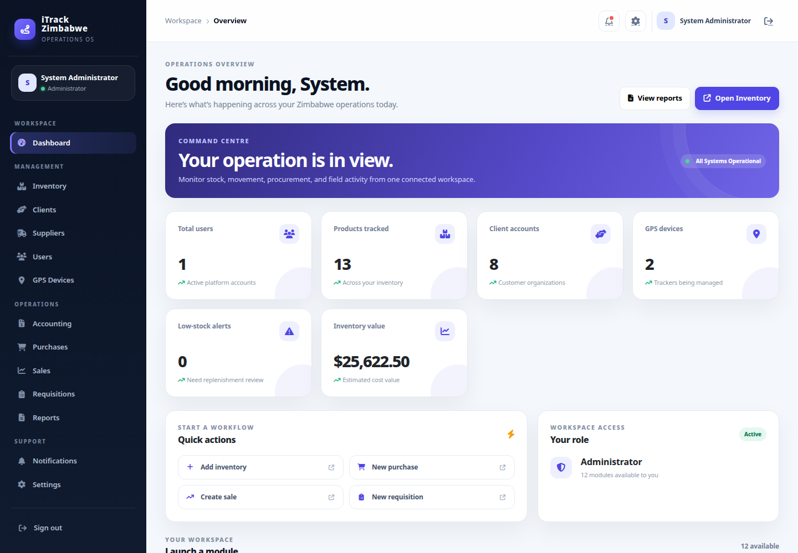 |
| Dashboard mobile | 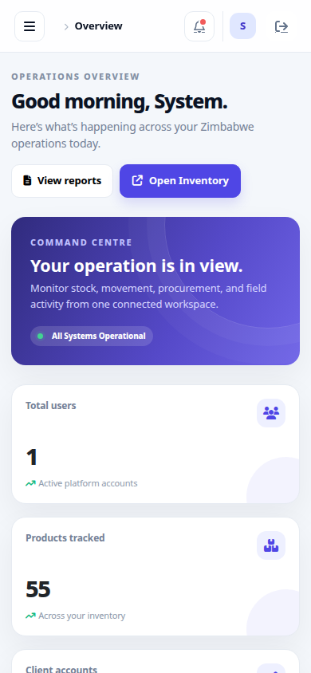 |
| Inventory | 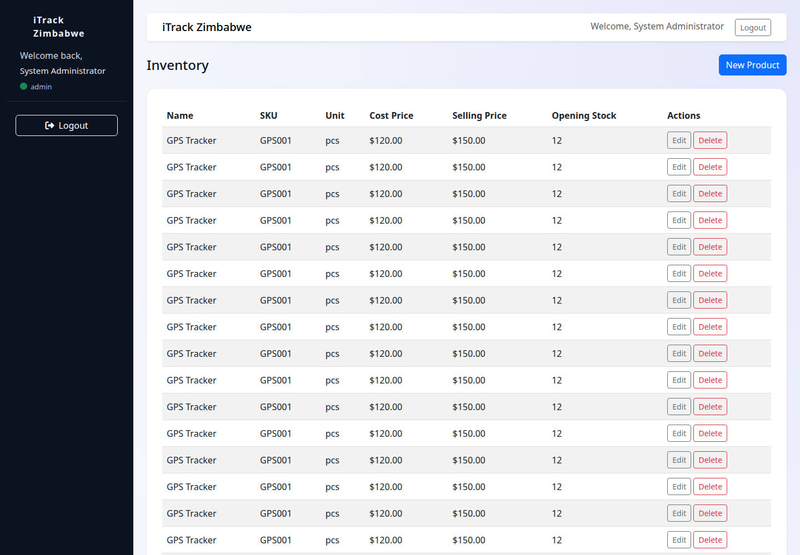 |
| Purchases | 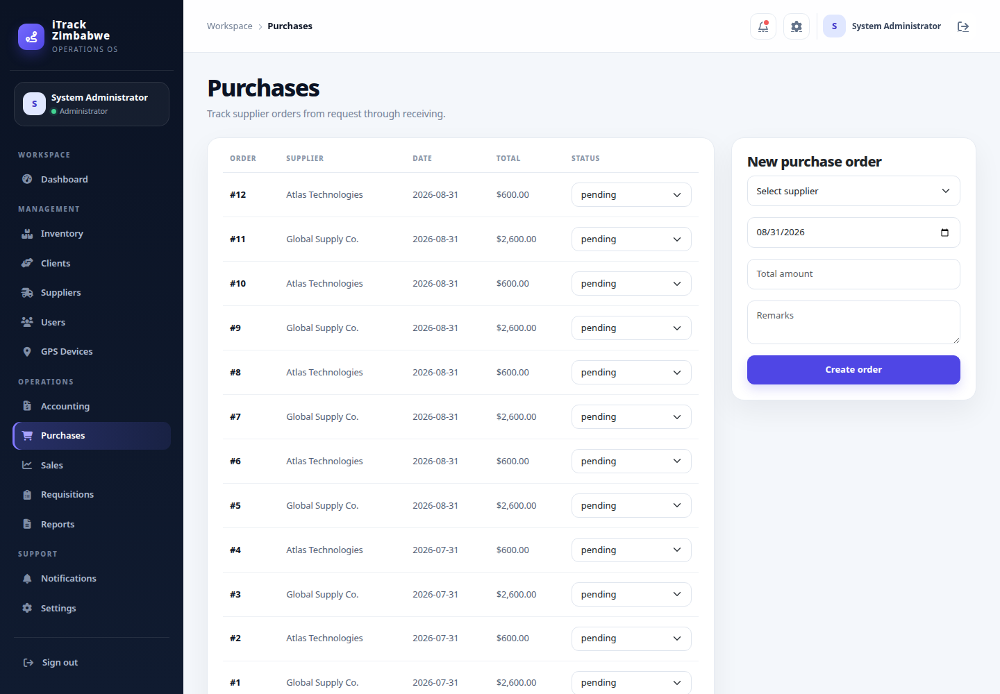 |
| Sales | 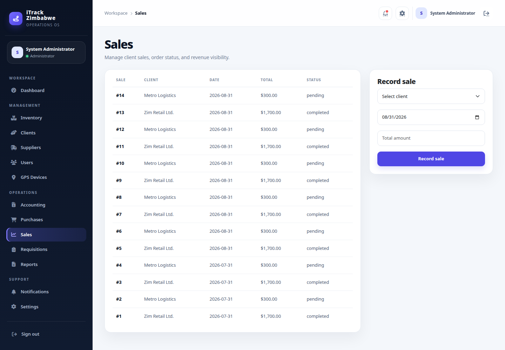 |
| Requisitions | 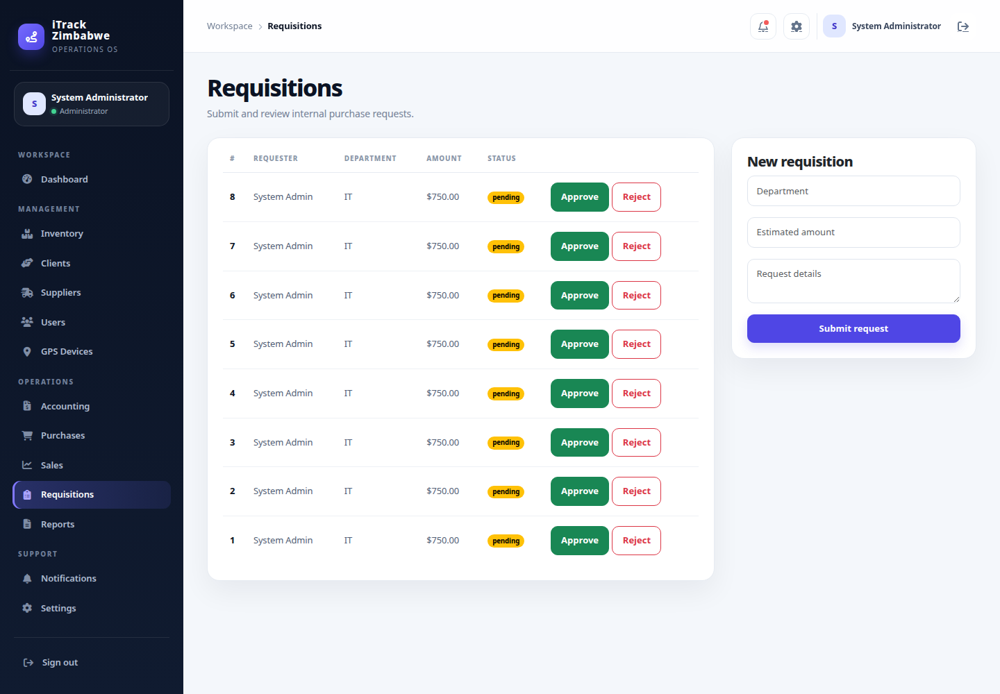 |
| Reports | 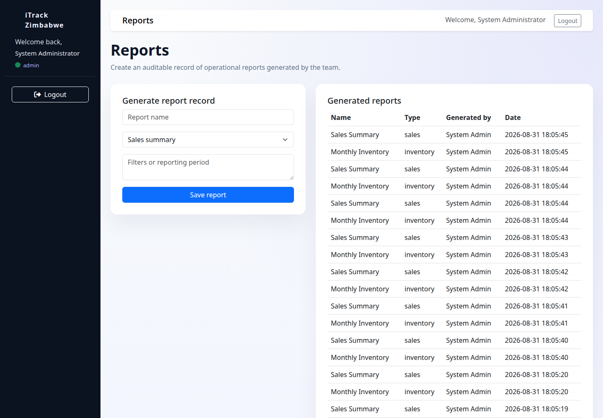 |
| Accounting | 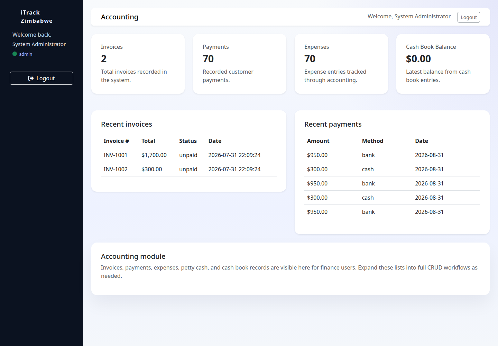 |
| GPS devices | 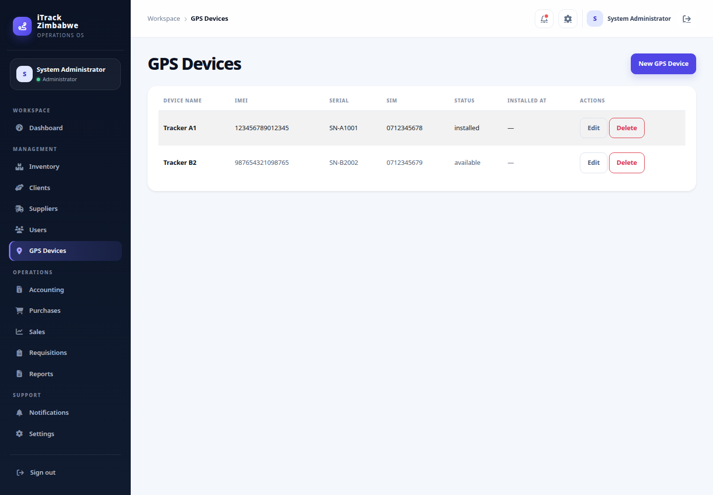 |
| Clients | 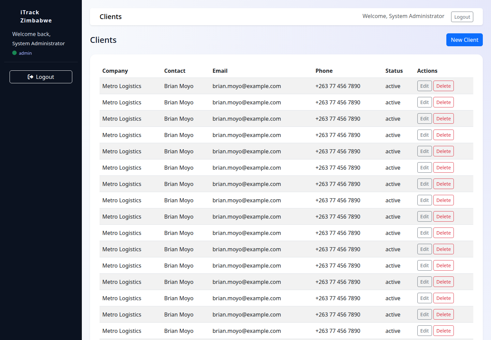 |
| Suppliers | 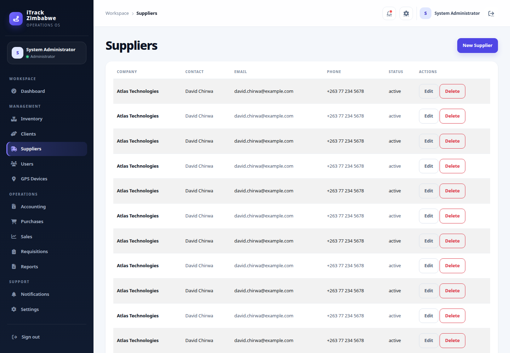 |
| Notifications | 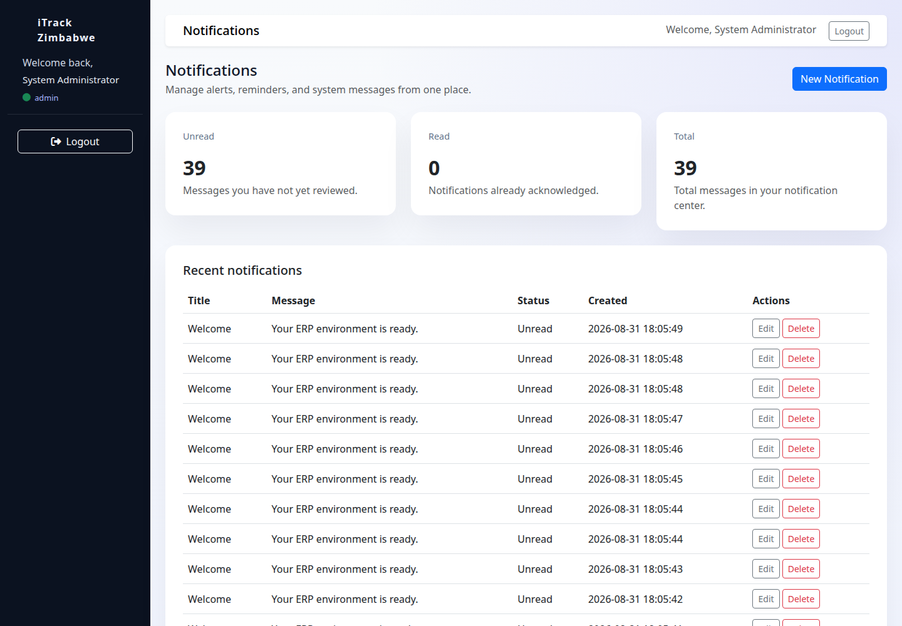 |
| Users | 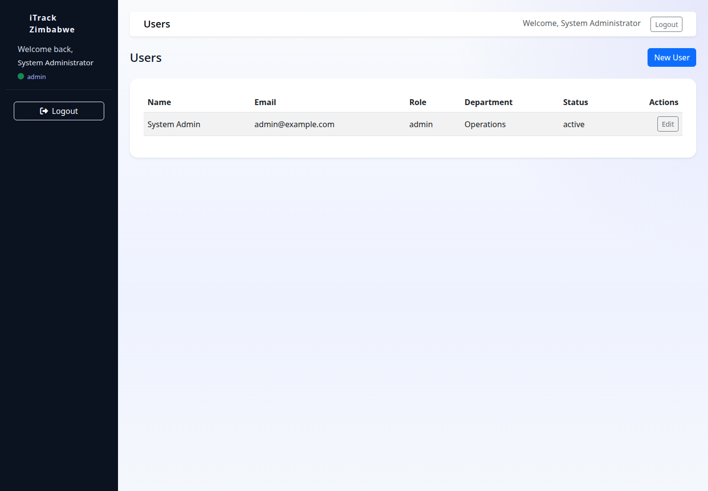 |
| Settings | 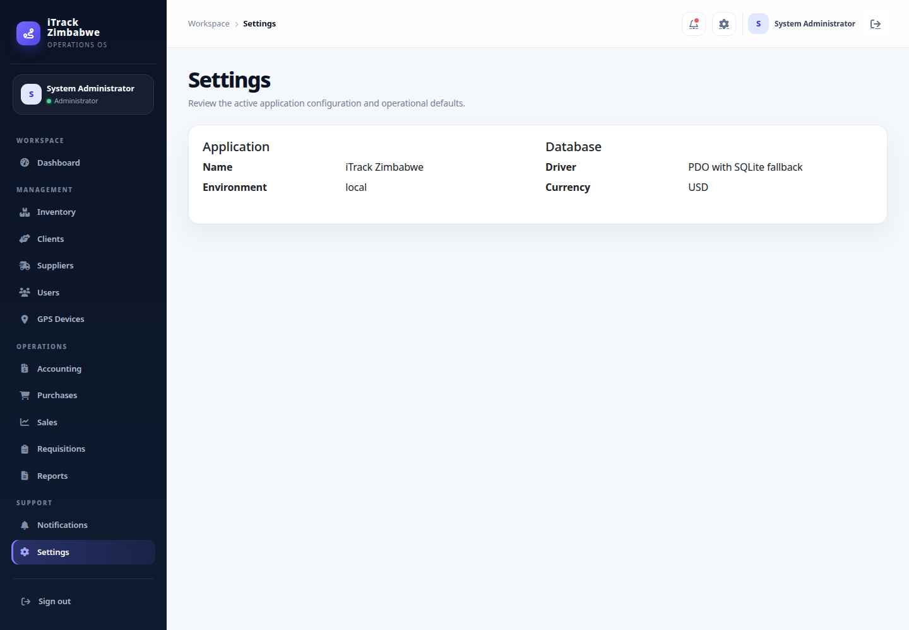 |

## Application routes

All authenticated modules are routed through `public/index.php` using the `controller` and `action` query parameters. Examples include `?controller=inventory`, `?controller=clients`, `?controller=purchases`, `?controller=sales`, `?controller=requisition`, `?controller=reports`, `?controller=notification`, and `?controller=settings`.

## Database

MySQL deployments should import `database/schema.sql` followed by `database/seed.sql` and set the `DB_*` variables in `.env`. Local development uses the SQLite schema and seed logic in `app/config/database.php`.

## Verification

The project has been checked with a full PHP syntax pass, authenticated HTTP smoke tests for every dashboard module, public registration and password-recovery page checks, JSON validation for every public API endpoint, and authenticated create-action checks for purchases, sales, requisitions, and reports.

## Documentation

Additional installation, development, architecture, deployment, and security guidance is available in [docs](docs/).
